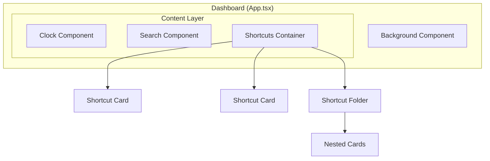

# Design Document

## Overview

本设计文档描述浏览器新标签页风格看板界面的技术实现方案。采用 React + TypeScript + Tailwind CSS 技术栈，实现四个核心组件：时间组件、搜索框组件、快捷入口卡片组件和背景壁纸组件。

## Architecture



### 组件层级结构

```
src/
├── components/
│   ├── Clock/
│   │   └── Clock.tsx           # 时间组件
│   ├── Search/
│   │   └── Search.tsx          # 搜索框组件
│   ├── Shortcuts/
│   │   ├── ShortcutCard.tsx    # 快捷入口卡片
│   │   ├── ShortcutFolder.tsx  # 快捷入口文件夹
│   │   └── ShortcutsContainer.tsx # 快捷入口容器
│   └── Background/
│       └── Background.tsx      # 背景壁纸组件
├── hooks/
│   └── useClock.ts             # 时钟逻辑 Hook
├── utils/
│   └── lunar.ts                # 农历转换工具
├── types/
│   └── index.ts                # 类型定义
└── App.tsx                     # 主应用入口
```

## Components and Interfaces

### Clock Component

```typescript
interface ClockProps {
  className?: string;
}

interface ClockState {
  time: string;        // HH:MM:SS
  date: string;        // MM月DD日
  weekday: string;     // 星期X
  lunar: string;       // 农历日期
}
```

**实现要点：**
- 使用 `setInterval` 每秒更新时间
- 使用 `useEffect` 管理定时器生命周期
- 农历转换使用简化算法或第三方库

### Search Component

```typescript
interface SearchProps {
  placeholder?: string;
  searchEngine?: 'bing' | 'google' | 'baidu';
  className?: string;
}
```

**实现要点：**
- 受控输入组件
- Enter 键触发搜索
- 搜索引擎 URL 模板：`https://www.bing.com/search?q={query}`

### Shortcut Card Component

```typescript
interface ShortcutItem {
  id: string;
  name: string;
  url: string;
  icon: string;        // 图标 URL 或 base64
}

interface ShortcutCardProps {
  item: ShortcutItem;
  onClick?: (item: ShortcutItem) => void;
  className?: string;
}
```

### Shortcut Folder Component

```typescript
interface ShortcutFolder {
  id: string;
  name: string;
  items: ShortcutItem[];
}

interface ShortcutFolderProps {
  folder: ShortcutFolder;
  onOpen?: (folder: ShortcutFolder) => void;
  className?: string;
}
```

### Background Component

```typescript
interface BackgroundProps {
  imageUrl: string;
  className?: string;
}
```

## Data Models

### 快捷入口数据结构

```typescript
// types/index.ts
export interface ShortcutItem {
  id: string;
  name: string;
  url: string;
  icon: string;
}

export interface ShortcutFolder {
  id: string;
  name: string;
  items: ShortcutItem[];
  isFolder: true;
}

export type ShortcutEntry = ShortcutItem | ShortcutFolder;

// 默认快捷入口数据
export const defaultShortcuts: ShortcutEntry[] = [
  { id: '1', name: '爱奇艺', url: 'https://www.iqiyi.com', icon: '/icons/iqiyi.png' },
  { id: '2', name: '芒果TV', url: 'https://www.mgtv.com', icon: '/icons/mgtv.png' },
  { id: '3', name: '抖音', url: 'https://www.douyin.com', icon: '/icons/douyin.png' },
  // ...更多快捷入口
];
```

### 时钟状态数据

```typescript
export interface ClockData {
  hours: string;
  minutes: string;
  seconds: string;
  year: number;
  month: number;
  day: number;
  weekday: number;
  lunarMonth: string;
  lunarDay: string;
}
```


## Correctness Properties

*A property is a characteristic or behavior that should hold true across all valid executions of a system—essentially, a formal statement about what the system should do. Properties serve as the bridge between human-readable specifications and machine-verifiable correctness guarantees.*

基于需求分析，以下是可测试的正确性属性：

### Property 1: Time Format Validity

*For any* valid JavaScript Date object, the `formatTime` function SHALL produce a string matching the pattern `HH:MM:SS` where HH is 00-23, MM is 00-59, and SS is 00-59.

**Validates: Requirements 1.1**

### Property 2: Date Format Validity

*For any* valid JavaScript Date object, the `formatDate` function SHALL produce a string matching the pattern `MM月DD日` where MM is 01-12 and DD is 01-31.

**Validates: Requirements 1.2**

### Property 3: Weekday Mapping Correctness

*For any* valid JavaScript Date object, the `getWeekday` function SHALL return exactly one of the seven valid Chinese weekday strings: 星期日, 星期一, 星期二, 星期三, 星期四, 星期五, 星期六.

**Validates: Requirements 1.3**

### Property 4: Search URL Generation

*For any* non-empty search query string, the `generateSearchUrl` function SHALL produce a valid URL containing the properly URL-encoded query parameter.

**Validates: Requirements 2.4**

### Property 5: Shortcut Card Navigation

*For any* valid ShortcutItem with a non-empty URL, clicking the card SHALL trigger navigation to exactly that URL.

**Validates: Requirements 3.4**

### Property 6: Folder Default Name

*For any* ShortcutFolder created without an explicit name, the folder name SHALL default to "新文件夹".

**Validates: Requirements 4.2**

### Property 7: Folder Item Containment

*For any* array of ShortcutItems, a ShortcutFolder SHALL be able to contain all items and the folder's items array length SHALL equal the input array length.

**Validates: Requirements 4.5**

## Error Handling

### Clock Component
- 如果系统时间获取失败，显示 "--:--:--" 作为占位符
- 农历转换失败时，隐藏农历显示区域

### Search Component
- 空查询时阻止搜索提交
- 特殊字符自动进行 URL 编码

### Shortcut Card
- 图标加载失败时显示默认占位图标
- URL 无效时阻止导航并显示提示

### Shortcut Folder
- 空文件夹显示"空文件夹"提示
- 文件夹名称为空时使用默认名称

### Background Component
- 背景图加载失败时使用纯色渐变背景作为降级方案

## Testing Strategy

### 单元测试 (Unit Tests)

使用 Vitest 进行单元测试：

1. **时间格式化函数测试**
   - 测试边界值：00:00:00, 23:59:59
   - 测试日期边界：1月1日, 12月31日

2. **搜索 URL 生成测试**
   - 测试普通查询
   - 测试特殊字符编码
   - 测试空查询处理

3. **快捷入口数据验证**
   - 测试 ShortcutItem 类型守卫
   - 测试 ShortcutFolder 类型守卫

### 属性测试 (Property-Based Tests)

使用 fast-check 进行属性测试，每个属性测试运行最少 100 次迭代：

1. **Property 1**: 时间格式有效性
   - 生成随机 Date 对象
   - 验证输出匹配 HH:MM:SS 模式

2. **Property 2**: 日期格式有效性
   - 生成随机 Date 对象
   - 验证输出匹配 MM月DD日 模式

3. **Property 3**: 星期映射正确性
   - 生成随机 Date 对象
   - 验证输出在有效星期字符串集合中

4. **Property 4**: 搜索 URL 生成
   - 生成随机非空字符串
   - 验证生成的 URL 有效且包含编码后的查询

5. **Property 6**: 文件夹默认名称
   - 生成无名称的文件夹
   - 验证名称为 "新文件夹"

6. **Property 7**: 文件夹项目容纳
   - 生成随机 ShortcutItem 数组
   - 验证文件夹可容纳所有项目

### 测试配置

```typescript
// vitest.config.ts
export default {
  test: {
    environment: 'jsdom',
    globals: true,
  }
}
```

测试标签格式：`**Feature: dashboard-components, Property {number}: {property_text}**`
