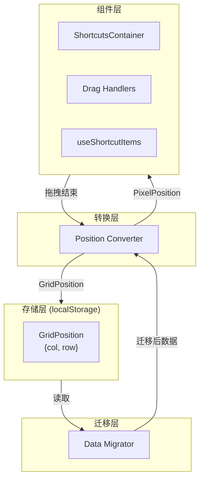

# Design Document: Grid Position Storage Refactor

## Overview

本设计文档描述了将卡片位置存储从像素坐标 (x, y) 重构为网格坐标 (col, row) 的技术方案。

核心设计思路：
1. **存储层**：修改 `Position` 类型，使用 `col` 和 `row` 替代 `x` 和 `y`
2. **转换层**：在渲染和拖拽时进行坐标转换，保持组件接口不变
3. **迁移层**：在数据加载时自动检测并迁移旧格式数据

## Architecture



### 数据流

1. **读取流程**：Storage → Migrator → Converter → Components (PixelPosition)
2. **写入流程**：Components (PixelPosition) → Converter → Storage (GridPosition)

## Components and Interfaces

### 1. GridPosition 类型

新增网格坐标类型，替代原有的 Position 类型用于存储：

```typescript
// src/types/core.ts

// 网格坐标（用于存储）
export interface GridPosition {
  col: number;
  row: number;
}

// 像素坐标（用于渲染，保留用于组件内部）
export interface PixelPosition {
  x: number;
  y: number;
}

// 保持 Position 别名以兼容现有代码
export type Position = PixelPosition;
```

### 2. Position Converter 模块

扩展 `gridUtils.ts`，提供统一的坐标转换接口：

```typescript
// src/utils/gridUtils.ts

/**
 * 将网格坐标转换为像素坐标（用于渲染）
 */
export function gridToPixel(
  col: number, 
  row: number, 
  unit: number, 
  gap: number
): PixelPosition;

/**
 * 将像素坐标转换为网格坐标（用于存储）
 */
export function pixelToGrid(
  x: number, 
  y: number, 
  unit: number, 
  gap: number
): GridPosition;

/**
 * 将网格坐标限制在有效边界内
 */
export function clampGridPosition(
  col: number,
  row: number,
  colSpan: number,
  rowSpan: number,
  columns: number,
  rows: number
): GridPosition;
```

### 3. Data Migrator 模块

新增数据迁移模块，处理旧格式数据：

```typescript
// src/features/shortcuts/store/migration.ts

/**
 * 检测位置数据是否为旧格式（像素坐标）
 */
export function isLegacyPosition(position: unknown): boolean;

/**
 * 迁移单个位置数据
 */
export function migratePosition(
  position: { x: number; y: number },
  unit: number,
  gap: number
): GridPosition;

/**
 * 迁移整个快捷方式列表
 */
export function migrateShortcuts(
  shortcuts: unknown[],
  gridConfig: GridConfig
): GridItem[];
```

### 4. 修改的现有组件

#### ShortcutItem / ShortcutFolder / PluginCardItem 类型

```typescript
// src/types/shortcuts.ts
export interface ShortcutItem {
  id: string;
  name: string;
  url: string;
  icon: string;
  size?: CardSize;
  position?: GridPosition;  // 改为 GridPosition
  openMode?: OpenMode;
}
```

#### useShortcutItems Hook

修改为在渲染时将 GridPosition 转换为 PixelPosition：

```typescript
// src/features/shortcuts/hooks/useShortcutItems.ts
export function useShortcutItems({ shortcuts, columns, rows, unit, gap }) {
  const items = useMemo(() => {
    return shortcuts.map((item) => {
      if (item.position) {
        // position 现在是 GridPosition，转换为 PixelPosition 用于渲染
        const pixelPos = gridToPixel(item.position.col, item.position.row, unit, gap);
        return { ...item, _renderPosition: pixelPos };
      }
      // ... 分配位置逻辑
    });
  }, [shortcuts, columns, rows, unit, gap]);
}
```

#### useDragHandlers Hook

修改拖拽结束处理，将像素位置转换为网格坐标存储：

```typescript
// src/features/shortcuts/hooks/useDragHandlers.ts
const handleDragEnd = (event: DragEndEvent) => {
  // ... 计算最终像素位置
  const targetGrid = pixelToGrid(newPixelPos.x, newPixelPos.y, unit, gap);
  const clampedGrid = clampGridPosition(targetGrid.col, targetGrid.row, colSpan, rowSpan, columns, rows);
  
  // 存储网格坐标
  const newItems = items.map(item => 
    item.id === draggedItemId 
      ? { ...item, position: clampedGrid }  // 存储 GridPosition
      : item
  );
  onShortcutsChange?.(newItems);
};
```

## Data Models

### 存储数据结构变更

**Before (旧格式)**:
```json
{
  "shortcuts": [
    {
      "id": "shortcut-1",
      "name": "Google",
      "url": "https://google.com",
      "icon": "🔍",
      "size": "1x1",
      "position": { "x": 0, "y": 0 }
    }
  ]
}
```

**After (新格式)**:
```json
{
  "shortcuts": [
    {
      "id": "shortcut-1",
      "name": "Google",
      "url": "https://google.com",
      "icon": "🔍",
      "size": "1x1",
      "position": { "col": 0, "row": 0 }
    }
  ]
}
```

### 迁移检测逻辑

通过检查 position 对象的属性来判断格式：
- 包含 `x` 和 `y` → 旧格式，需要迁移
- 包含 `col` 和 `row` → 新格式，无需迁移


## Correctness Properties

*A property is a characteristic or behavior that should hold true across all valid executions of a system—essentially, a formal statement about what the system should do. Properties serve as the bridge between human-readable specifications and machine-verifiable correctness guarantees.*

Based on the prework analysis, the following properties have been identified and consolidated to eliminate redundancy:

### Property 1: Grid-to-Pixel Conversion Alignment

*For any* valid GridPosition (col, row) and any valid GridConfig (unit, gap), converting to PixelPosition and back to GridPosition SHALL produce the original GridPosition.

This is a round-trip property that validates the conversion functions are consistent and that pixel positions align to grid boundaries.

**Validates: Requirements 2.1, 2.3**

### Property 2: Pixel-to-Grid Rounding Correctness

*For any* PixelPosition (x, y) within the grid bounds, the converted GridPosition SHALL be the nearest valid grid cell, meaning no other grid cell is closer to the original pixel position.

**Validates: Requirements 3.1, 3.2**

### Property 3: Boundary Clamping Validity

*For any* GridPosition (col, row) and card size (colSpan, rowSpan), the clamped position SHALL satisfy:
- `0 <= col <= columns - colSpan`
- `0 <= row <= rows - rowSpan`

**Validates: Requirements 3.4**

### Property 4: Legacy Format Detection

*For any* position object, `isLegacyPosition` SHALL return `true` if and only if the object has `x` and `y` properties but not `col` and `row` properties.

**Validates: Requirements 4.1**

### Property 5: Migration Idempotence

*For any* data already in GridPosition format, running the migration function SHALL return an equivalent GridPosition (migration is a no-op for new format).

**Validates: Requirements 4.4**

### Property 6: Migration Correctness

*For any* valid legacy PixelPosition, migrating to GridPosition and then converting back to PixelPosition using the same GridConfig SHALL produce a position within one grid cell of the original.

**Validates: Requirements 4.2**

## Error Handling

### 迁移错误处理

1. **无效位置数据**：如果 position 对象既没有 (x, y) 也没有 (col, row)，分配默认位置 (0, 0) 并记录警告
2. **NaN 或 Infinity 值**：检测并替换为默认值 0
3. **负数坐标**：在迁移时 clamp 到 0

### 边界错误处理

1. **超出网格边界**：自动 clamp 到有效范围内
2. **碰撞检测失败**：保持原位置不变，由 GridManager 处理

### 类型安全

1. 使用 TypeScript 严格模式确保类型正确
2. 运行时类型检查用于处理 localStorage 中的不可信数据

## Testing Strategy

### 测试框架

- **单元测试**: Vitest
- **属性测试**: fast-check (与 Vitest 集成)
- **E2E 测试**: Playwright

### 单元测试

单元测试用于验证具体示例和边缘情况：

1. **gridToPixel 函数**
   - 测试 (0, 0) 转换为 (0, 0)
   - 测试 (1, 1) 转换为正确的像素位置
   - 测试边界位置

2. **pixelToGrid 函数**
   - 测试精确网格位置
   - 测试需要四舍五入的位置
   - 测试负数输入

3. **isLegacyPosition 函数**
   - 测试 `{ x: 0, y: 0 }` 返回 true
   - 测试 `{ col: 0, row: 0 }` 返回 false
   - 测试 `null` 和 `undefined`

4. **migrateShortcuts 函数**
   - 测试空数组
   - 测试混合格式数据
   - 测试无效数据处理

### 属性测试

属性测试用于验证通用属性，每个测试至少运行 100 次迭代：

```typescript
// 示例：Property 1 - Round-trip conversion
// Feature: grid-position-storage-refactor, Property 1: Grid-to-Pixel Conversion Alignment
describe('gridToPixel and pixelToGrid', () => {
  it('round-trip preserves grid position', () => {
    fc.assert(
      fc.property(
        fc.integer({ min: 0, max: 11 }), // col
        fc.integer({ min: 0, max: 3 }),  // row
        fc.integer({ min: 32, max: 128 }), // unit
        fc.integer({ min: 8, max: 32 }),   // gap
        (col, row, unit, gap) => {
          const pixel = gridToPixel(col, row, unit, gap);
          const grid = pixelToGrid(pixel.x, pixel.y, unit, gap);
          return grid.col === col && grid.row === row;
        }
      ),
      { numRuns: 100 }
    );
  });
});
```

### 测试覆盖要求

- 所有 Correctness Properties 必须有对应的属性测试
- 边缘情况使用单元测试覆盖
- 迁移逻辑需要集成测试验证端到端流程

