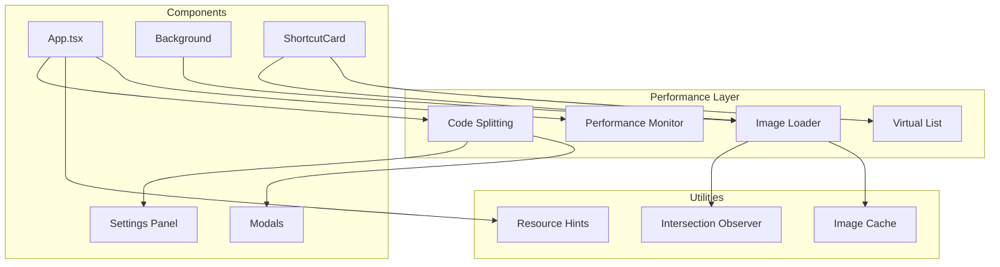

# Design Document: Performance Optimization

## Overview

本设计文档描述浏览器新标签页应用的性能优化方案。通过图片懒加载/预加载、组件懒加载、渲染优化、虚拟化列表和资源加载优化等技术手段，提升应用的加载速度和运行时性能。

## Architecture



## Components and Interfaces

### 1. Image Loader Hook (useImageLoader)

负责图片的懒加载、预加载和错误处理。

```typescript
interface UseImageLoaderOptions {
  src: string;
  placeholder?: string;
  fallback?: string;
  preload?: boolean;
  rootMargin?: string;
}

interface UseImageLoaderResult {
  imageSrc: string;
  isLoading: boolean;
  isError: boolean;
  ref: React.RefObject<HTMLElement>;
}

function useImageLoader(options: UseImageLoaderOptions): UseImageLoaderResult;
```

### 2. LazyImage Component

封装懒加载逻辑的图片组件。

```typescript
interface LazyImageProps {
  src: string;
  alt: string;
  placeholder?: string;
  fallback?: string;
  className?: string;
  onLoad?: () => void;
  onError?: () => void;
}

function LazyImage(props: LazyImageProps): JSX.Element;
```

### 3. Image Preloader Utility

预加载图片的工具函数。

```typescript
interface PreloadOptions {
  priority?: 'high' | 'low';
  maxConcurrent?: number;
}

function preloadImage(src: string, options?: PreloadOptions): Promise<void>;
function preloadImages(srcs: string[], options?: PreloadOptions): Promise<void>;
```

### 4. Lazy Component Wrapper

组件懒加载的包装器。

```typescript
interface LazyComponentProps {
  fallback?: React.ReactNode;
  errorFallback?: React.ReactNode;
  onError?: (error: Error) => void;
}

// 使用 React.lazy 创建懒加载组件
const LazySettingsPanel = lazy(() => import('./Settings/SettingsPanel'));
const LazyAddShortcutModal = lazy(() => import('./Shortcuts/AddShortcutModal'));
const LazyAddFolderModal = lazy(() => import('./Shortcuts/AddFolderModal'));
const LazyWallpaperModal = lazy(() => import('./Settings/WallpaperModal'));
```

### 5. Virtual List Component

虚拟化列表组件，用于大量快捷方式的高效渲染。

```typescript
interface VirtualGridProps<T> {
  items: T[];
  columns: number;
  rowHeight: number;
  gap: number;
  renderItem: (item: T, index: number) => React.ReactNode;
  threshold?: number; // 启用虚拟化的阈值，默认 50
}

function VirtualGrid<T>(props: VirtualGridProps<T>): JSX.Element;
```

### 6. Resource Hints Component

资源提示组件，添加 preconnect 和 dns-prefetch。

```typescript
interface ResourceHintsProps {
  preconnect?: string[];
  dnsPrefetch?: string[];
  preload?: Array<{ href: string; as: string }>;
}

function ResourceHints(props: ResourceHintsProps): JSX.Element;
```

### 7. Performance Monitor Hook

性能监控 Hook。

```typescript
interface PerformanceMetrics {
  fcp: number | null;  // First Contentful Paint
  lcp: number | null;  // Largest Contentful Paint
  cls: number | null;  // Cumulative Layout Shift
}

interface UsePerformanceMonitorOptions {
  enabled?: boolean;
  thresholds?: {
    fcp?: number;
    lcp?: number;
    cls?: number;
  };
  onThresholdExceeded?: (metric: string, value: number) => void;
}

function usePerformanceMonitor(options?: UsePerformanceMonitorOptions): PerformanceMetrics;
```

## Data Models

### Image Cache Entry

```typescript
interface ImageCacheEntry {
  src: string;
  status: 'loading' | 'loaded' | 'error';
  timestamp: number;
  element?: HTMLImageElement;
}

// 内存缓存，避免重复加载
const imageCache = new Map<string, ImageCacheEntry>();
```

### Performance Thresholds

```typescript
const PERFORMANCE_THRESHOLDS = {
  FCP: 1800,  // 1.8s - Good
  LCP: 2500,  // 2.5s - Good
  CLS: 0.1,   // 0.1 - Good
} as const;
```

## Error Handling

### Image Loading Errors

1. 当图片加载失败时，显示 fallback 图片或默认图标
2. 记录错误到控制台（开发模式）
3. 支持重试机制

### Lazy Component Loading Errors

1. 使用 ErrorBoundary 捕获加载错误
2. 显示错误提示和重试按钮
3. 记录错误信息

### Performance Monitoring Errors

1. 如果 Performance API 不可用，静默降级
2. 不影响应用正常功能


## Correctness Properties

*A property is a characteristic or behavior that should hold true across all valid executions of a system—essentially, a formal statement about what the system should do. Properties serve as the bridge between human-readable specifications and machine-verifiable correctness guarantees.*

### Property 1: Image Fallback on Error

*For any* image URL that fails to load, the Image_Loader SHALL display the specified fallback image instead of a broken image indicator.

**Validates: Requirements 1.4**

### Property 2: Concurrent Preload Limit

*For any* number of preload requests submitted simultaneously, the Image_Loader SHALL ensure that no more than the configured maximum number of requests are active at any given time.

**Validates: Requirements 2.4**

### Property 3: Memoized Component Re-render Prevention

*For any* memoized component (Clock, Search, ShortcutCard), when state changes occur that do not affect that component's props, the component SHALL NOT re-render.

**Validates: Requirements 4.2, 4.3, 4.4, 4.5**

### Property 4: Virtual List Rendering Efficiency

*For any* list with more than 50 items, the Virtual_List SHALL render fewer DOM elements than the total item count, only rendering items within or near the visible viewport.

**Validates: Requirements 5.1**

### Property 5: Virtual List Variable Size Support

*For any* combination of item sizes (1x1, 1x2, 2x1, 2x2, 2x4), the Virtual_List SHALL correctly calculate positions and render items without overlap or gaps.

**Validates: Requirements 5.3**

### Property 6: Virtual List Scroll Position Preservation

*For any* add or remove operation on the Virtual_List, the current scroll position SHALL be preserved relative to the visible content.

**Validates: Requirements 5.5**

### Property 7: Performance Threshold Warning

*For any* performance metric value that exceeds its configured threshold, the Performance_Monitor SHALL emit a warning with the metric name and value.

**Validates: Requirements 7.5**

## Testing Strategy

### Unit Tests

单元测试用于验证特定示例和边界情况：

1. **Image Loader Tests**
   - 测试 placeholder 在加载时显示
   - 测试 fallback 在错误时显示
   - 测试加载成功后的状态更新

2. **Lazy Component Tests**
   - 测试加载指示器显示
   - 测试错误状态和重试功能

3. **Resource Hints Tests**
   - 测试 preconnect 链接生成
   - 测试 dns-prefetch 链接生成

4. **Performance Monitor Tests**
   - 测试 FCP/LCP/CLS 指标收集
   - 测试开发模式日志输出
   - 测试生产模式禁用

### Property-Based Tests

属性测试使用 fast-check 库验证通用属性：

- 每个属性测试至少运行 100 次迭代
- 测试标签格式：**Feature: performance-optimization, Property {number}: {property_text}**

1. **Property 1 Test**: 生成随机的失败 URL，验证 fallback 显示
2. **Property 2 Test**: 生成随机数量的预加载请求，验证并发限制
3. **Property 3 Test**: 生成随机状态变化，验证无关组件不重渲染
4. **Property 4 Test**: 生成超过 50 项的列表，验证 DOM 元素数量
5. **Property 5 Test**: 生成随机尺寸组合，验证布局正确性
6. **Property 6 Test**: 生成随机增删操作，验证滚动位置保持
7. **Property 7 Test**: 生成随机超阈值指标，验证警告输出

### Testing Framework

- 测试框架：Vitest
- 属性测试库：fast-check
- React 测试：@testing-library/react
- DOM 测试：jsdom

