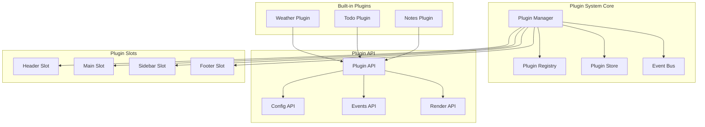

# Design Document: Plugin System

## Overview

本设计文档描述浏览器新标签页应用的插件系统架构。插件系统采用模块化设计，提供统一的 API 接口，支持插件的注册、加载、配置和渲染。内置插件包括天气组件、待办事项和便签功能。

## Architecture



## Components and Interfaces

### 1. Plugin Interface

插件的基本接口定义。

```typescript
interface PluginMetadata {
  id: string;           // 唯一标识符
  name: string;         // 显示名称
  version: string;      // 版本号
  description?: string; // 描述
  author?: string;      // 作者
  icon?: string;        // 图标 URL 或 React 组件
}

interface PluginConfig {
  [key: string]: unknown;
}

interface PluginConfigSchema {
  [key: string]: {
    type: 'string' | 'number' | 'boolean' | 'select';
    label: string;
    default: unknown;
    options?: Array<{ label: string; value: unknown }>;
    min?: number;
    max?: number;
  };
}

interface Plugin {
  metadata: PluginMetadata;
  configSchema?: PluginConfigSchema;
  defaultConfig?: PluginConfig;
  
  // 生命周期钩子
  onRegister?: (api: PluginAPI) => void;
  onEnable?: (api: PluginAPI) => void;
  onDisable?: (api: PluginAPI) => void;
  onUninstall?: (api: PluginAPI) => void;
  onConfigChange?: (config: PluginConfig, api: PluginAPI) => void;
  
  // 渲染方法
  render?: (api: PluginAPI) => React.ReactNode;
  renderSettings?: (api: PluginAPI) => React.ReactNode;
  
  // 插件槽位
  slot?: 'header' | 'main' | 'sidebar' | 'footer';
  order?: number; // 同一槽位内的排序
}
```

### 2. Plugin API

提供给插件的 API 接口。

```typescript
interface PluginAPI {
  // 配置管理
  getConfig: <T = PluginConfig>() => T;
  setConfig: (config: Partial<PluginConfig>) => void;
  resetConfig: () => void;
  
  // 事件系统
  emit: (event: string, payload?: unknown) => void;
  on: (event: string, handler: (payload: unknown) => void) => () => void;
  off: (event: string, handler: (payload: unknown) => void) => void;
  
  // 存储
  getStorage: <T>(key: string) => T | null;
  setStorage: <T>(key: string, value: T) => void;
  removeStorage: (key: string) => void;
  
  // 工具方法
  showToast: (message: string, type?: 'success' | 'error' | 'info') => void;
  openModal: (content: React.ReactNode) => void;
  closeModal: () => void;
}
```

### 3. Plugin Manager

插件管理器，负责插件的生命周期管理。

```typescript
interface PluginManager {
  // 注册与加载
  register: (plugin: Plugin) => void;
  unregister: (pluginId: string) => void;
  
  // 生命周期
  enable: (pluginId: string) => void;
  disable: (pluginId: string) => void;
  
  // 查询
  getPlugin: (pluginId: string) => Plugin | undefined;
  getPlugins: () => Plugin[];
  getEnabledPlugins: () => Plugin[];
  isEnabled: (pluginId: string) => boolean;
  
  // 配置
  getPluginConfig: (pluginId: string) => PluginConfig;
  setPluginConfig: (pluginId: string, config: Partial<PluginConfig>) => void;
}
```

### 4. Plugin Store (Zustand)

插件状态存储。

```typescript
interface PluginState {
  // 插件状态
  enabledPlugins: Set<string>;
  pluginConfigs: Record<string, PluginConfig>;
  
  // Actions
  enablePlugin: (pluginId: string) => void;
  disablePlugin: (pluginId: string) => void;
  setPluginConfig: (pluginId: string, config: Partial<PluginConfig>) => void;
  resetPluginConfig: (pluginId: string) => void;
}
```

### 5. Plugin Slot Component

插件槽位组件。

```typescript
interface PluginSlotProps {
  name: 'header' | 'main' | 'sidebar' | 'footer';
  className?: string;
  style?: React.CSSProperties;
}

function PluginSlot({ name, className, style }: PluginSlotProps): JSX.Element;
```

### 6. Event Bus

插件间通信的事件总线。

```typescript
interface EventBus {
  emit: (pluginId: string, event: string, payload?: unknown) => void;
  on: (event: string, handler: EventHandler) => () => void;
  off: (event: string, handler: EventHandler) => void;
  clear: (pluginId: string) => void;
}

type EventHandler = (payload: unknown, source: string) => void;
```

## Data Models

### Plugin Storage Schema

```typescript
// localStorage key: 'plugin-system'
interface PluginStorageData {
  enabledPlugins: string[];
  configs: Record<string, PluginConfig>;
  pluginData: Record<string, Record<string, unknown>>;
}
```

### Weather Plugin Data

```typescript
interface WeatherConfig {
  location: string;
  unit: 'celsius' | 'fahrenheit';
  updateInterval: number; // minutes
}

interface WeatherData {
  temperature: number;
  condition: string;
  icon: string;
  humidity: number;
  lastUpdated: number;
}
```

### Todo Plugin Data

```typescript
interface TodoItem {
  id: string;
  text: string;
  completed: boolean;
  createdAt: number;
}

interface TodoConfig {
  showCompleted: boolean;
  sortBy: 'created' | 'name';
}
```

### Notes Plugin Data

```typescript
interface Note {
  id: string;
  content: string;
  color: string;
  createdAt: number;
  updatedAt: number;
}

interface NotesConfig {
  layout: 'grid' | 'list';
  defaultColor: string;
}
```

## Correctness Properties

### 1. Plugin Registration Invariants

- **Unique ID**: 每个已注册的插件必须有唯一的 ID，不允许重复注册
- **Valid Metadata**: 插件必须包含有效的 metadata（id, name, version 为必填）
- **Registry Consistency**: Plugin Registry 中的插件数量必须与实际注册的插件数量一致

### 2. Lifecycle State Machine

插件状态转换必须遵循以下规则：

```
[Unregistered] -> register() -> [Registered/Disabled]
[Registered/Disabled] -> enable() -> [Enabled]
[Enabled] -> disable() -> [Disabled]
[Disabled] -> enable() -> [Enabled]
[Disabled] -> unregister() -> [Unregistered]
[Enabled] -> unregister() -> [Unregistered] (自动先 disable)
```

- 不能对未注册的插件执行 enable/disable
- enable 时必须调用 onEnable 钩子
- disable 时必须调用 onDisable 钩子

### 3. Configuration Integrity

- **Schema Validation**: 配置值必须符合 configSchema 定义的类型
- **Persistence Consistency**: 内存中的配置必须与 localStorage 中的配置同步
- **Default Fallback**: 缺失的配置项必须使用 defaultConfig 中的值

### 4. Event Bus Guarantees

- **Delivery**: 已订阅的事件处理器必须收到所有发送的事件
- **Cleanup**: 插件禁用时必须清理所有事件订阅
- **Namespace Isolation**: 事件必须包含来源插件 ID，避免命名冲突

### 5. Rendering Safety

- **Error Boundary**: 插件渲染错误不能导致整个应用崩溃
- **Slot Ordering**: 同一槽位内的插件必须按 order 属性排序
- **Conditional Rendering**: 只有 enabled 状态的插件才能渲染

## Testing Strategy

### Unit Tests

1. **Plugin Manager Tests**
   - 测试插件注册、注销流程
   - 测试重复 ID 注册拒绝
   - 测试 enable/disable 状态切换
   - 测试生命周期钩子调用顺序

2. **Plugin Store Tests**
   - 测试状态持久化到 localStorage
   - 测试配置更新和重置
   - 测试应用启动时状态恢复

3. **Event Bus Tests**
   - 测试事件发送和接收
   - 测试事件订阅和取消订阅
   - 测试插件禁用时的清理

4. **Plugin API Tests**
   - 测试 getConfig/setConfig 方法
   - 测试 storage 方法
   - 测试工具方法（toast, modal）

### Integration Tests

1. **Plugin Lifecycle Integration**
   - 测试完整的插件生命周期流程
   - 测试多个插件同时运行
   - 测试插件间通信

2. **Built-in Plugins Integration**
   - 测试天气插件数据获取和显示
   - 测试待办事项的 CRUD 操作
   - 测试便签的创建和编辑

### Component Tests

1. **PluginSlot Component**
   - 测试插件渲染到正确槽位
   - 测试错误边界处理
   - 测试插件排序

2. **Plugin Settings UI**
   - 测试配置表单渲染
   - 测试配置值更新
   - 测试重置功能

