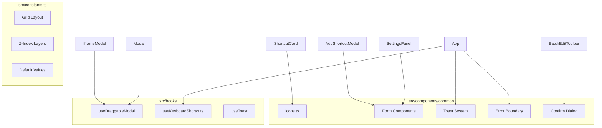

# Design Document

## Overview

本设计文档描述浏览器新标签页应用的代码优化和架构改进方案。通过创建可复用组件库、提取公共逻辑、统一常量管理、增强用户体验功能，提升代码质量和可维护性。

## Architecture



### 组件层级结构

```
src/
├── components/
│   └── common/
│       ├── icons.ts              # 集中管理的图标组件
│       ├── FormField.tsx         # 表单字段组件
│       ├── FormToggle.tsx        # 开关组件
│       ├── FormSelect.tsx        # 下拉选择组件
│       ├── FormSlider.tsx        # 滑块组件
│       ├── Toast.tsx             # Toast 消息组件
│       ├── ToastContainer.tsx    # Toast 容器
│       ├── ErrorBoundary.tsx     # 错误边界组件
│       ├── ConfirmDialog.tsx     # 确认对话框
│       └── index.ts              # 公共 API 导出
├── hooks/
│   ├── useDraggableModal.ts      # 可拖拽弹窗 Hook
│   ├── useKeyboardShortcuts.ts   # 键盘快捷键 Hook
│   └── useToast.ts               # Toast 消息 Hook
├── constants.ts                   # 全局常量
└── types/
    └── index.ts                   # 类型定义（扩展）
```

## Components and Interfaces

### Icon Library

```typescript
// src/components/common/icons.ts

interface IconProps {
  className?: string;
  size?: number | string;
  color?: string;
}

// 导出所有图标组件
export const AddIcon: React.FC<IconProps>;
export const FolderIcon: React.FC<IconProps>;
export const EditIcon: React.FC<IconProps>;
export const DeleteIcon: React.FC<IconProps>;
export const SettingsIcon: React.FC<IconProps>;
export const RefreshIcon: React.FC<IconProps>;
export const CloseIcon: React.FC<IconProps>;
export const SearchIcon: React.FC<IconProps>;
export const WallpaperIcon: React.FC<IconProps>;
export const MoveIcon: React.FC<IconProps>;
export const LayoutIcon: React.FC<IconProps>;
export const OpenTabIcon: React.FC<IconProps>;
export const CheckIcon: React.FC<IconProps>;
export const ChevronRightIcon: React.FC<IconProps>;
export const UploadIcon: React.FC<IconProps>;
export const LinkIcon: React.FC<IconProps>;
export const InfoIcon: React.FC<IconProps>;
export const WarningIcon: React.FC<IconProps>;
export const ErrorIcon: React.FC<IconProps>;
export const SuccessIcon: React.FC<IconProps>;
// ... 至少 20 个图标
```

### Form Components

```typescript
// FormField
interface FormFieldProps {
  label: string;
  error?: string;
  required?: boolean;
  children: React.ReactNode;
}

// FormToggle
interface FormToggleProps {
  label: string;
  description?: string;
  checked: boolean;
  onChange: (checked: boolean) => void;
  disabled?: boolean;
}

// FormSelect
interface FormSelectProps<T extends string> {
  label: string;
  value: T;
  options: { value: T; label: string }[];
  onChange: (value: T) => void;
  disabled?: boolean;
}

// FormSlider
interface FormSliderProps {
  label: string;
  value: number;
  min: number;
  max: number;
  step?: number;
  onChange: (value: number) => void;
  disabled?: boolean;
  showValue?: boolean;
}
```

### Toast System

```typescript
// Toast 类型
type ToastType = 'success' | 'error' | 'warning' | 'info';

interface Toast {
  id: string;
  type: ToastType;
  message: string;
  duration?: number; // 默认 3000ms
}

// useToast Hook
interface UseToastReturn {
  toasts: Toast[];
  showToast: (type: ToastType, message: string, duration?: number) => void;
  dismissToast: (id: string) => void;
  success: (message: string) => void;
  error: (message: string) => void;
  warning: (message: string) => void;
  info: (message: string) => void;
}

// ToastContainer 组件
interface ToastContainerProps {
  toasts: Toast[];
  onDismiss: (id: string) => void;
  position?: 'top-right' | 'top-left' | 'bottom-right' | 'bottom-left';
}
```

### Error Boundary

```typescript
interface ErrorBoundaryProps {
  children: React.ReactNode;
  fallback?: React.ReactNode;
  onError?: (error: Error, errorInfo: React.ErrorInfo) => void;
}

interface ErrorBoundaryState {
  hasError: boolean;
  error: Error | null;
}
```

### Draggable Modal Hook

```typescript
interface UseDraggableModalOptions {
  initialPosition?: { x: number; y: number };
  constrainToViewport?: boolean;
  disabled?: boolean;
}

interface UseDraggableModalReturn {
  position: { x: number; y: number };
  isDragging: boolean;
  handleMouseDown: (e: React.MouseEvent) => void;
  resetPosition: () => void;
}
```

### Confirm Dialog

```typescript
interface ConfirmDialogProps {
  isOpen: boolean;
  onClose: () => void;
  onConfirm: () => void;
  title: string;
  message: string;
  confirmLabel?: string;  // 默认 "确认"
  cancelLabel?: string;   // 默认 "取消"
  variant?: 'default' | 'danger';
}
```

### Keyboard Shortcuts Hook

```typescript
interface KeyboardShortcut {
  key: string;
  ctrlKey?: boolean;
  metaKey?: boolean;
  shiftKey?: boolean;
  handler: () => void;
  description: string;
}

interface UseKeyboardShortcutsOptions {
  shortcuts: KeyboardShortcut[];
  enabled?: boolean;
}
```

## Data Models

### Constants Module

```typescript
// src/constants.ts

// 网格布局
export const GRID = {
  COLUMNS: 12,
  ROWS: 4,
  UNIT: 72,
  GAP: 20,
} as const;

// Z-Index 层级
export const Z_INDEX = {
  BACKGROUND: 0,
  CONTENT: 10,
  SHORTCUTS: 20,
  CONTEXT_MENU: 50,
  MODAL: 100,
  TOAST: 200,
} as const;

// 动画时长
export const ANIMATION = {
  FAST: 150,
  NORMAL: 300,
  SLOW: 500,
} as const;

// 搜索历史
export const SEARCH = {
  MAX_HISTORY_ITEMS: 10,
} as const;

// Toast 配置
export const TOAST = {
  DEFAULT_DURATION: 3000,
  MAX_VISIBLE: 5,
} as const;

// 默认设置
export const DEFAULTS = {
  BACKGROUND_URL: 'https://images.unsplash.com/photo-1506905925346-21bda4d32df4?w=1920&q=80',
  BACKGROUND_BLUR: 0,
  BACKGROUND_OVERLAY: 0,
  SEARCH_ENGINE: 'bing' as const,
  CLOCK_FONT_SIZE: 'large' as const,
} as const;
```

### Extended Types

```typescript
// src/types/index.ts (扩展)

// Toast 类型
export type ToastType = 'success' | 'error' | 'warning' | 'info';

export interface ToastMessage {
  id: string;
  type: ToastType;
  message: string;
  duration: number;
  createdAt: number;
}

// 键盘快捷键
export interface KeyboardShortcutConfig {
  id: string;
  key: string;
  modifiers: ('ctrl' | 'meta' | 'shift' | 'alt')[];
  action: string;
  description: string;
}
```

## Correctness Properties

*A property is a characteristic or behavior that should hold true across all valid executions of a system—essentially, a formal statement about what the system should do. Properties serve as the bridge between human-readable specifications and machine-verifiable correctness guarantees.*

### Property 1: Icon Props Application

*For any* icon component and any valid size/color props, the rendered SVG element SHALL contain the corresponding style attributes or className.

**Validates: Requirements 1.2, 1.3**

### Property 2: Form Component Behavior

*For any* form component (Toggle, Select, Slider) and any valid props, the component SHALL:
- Render the correct value
- Call onChange with the new value when interacted with
- Respect the disabled state by preventing interaction

**Validates: Requirements 2.2, 2.3, 2.4, 2.6**

### Property 3: Toast System Rendering

*For any* toast type (success, error, warning, info) and any message string, the Toast component SHALL render with the correct styling and message content. *For any* number of toasts up to MAX_VISIBLE, they SHALL stack vertically without overlap.

**Validates: Requirements 3.1, 3.4**

### Property 4: Error Boundary Catches Errors

*For any* error thrown in a child component, the Error Boundary SHALL catch the error and render the fallback UI instead of crashing the entire application.

**Validates: Requirements 4.1**

### Property 5: Draggable Hook Position Management

*For any* mouse drag operation (mousedown → mousemove → mouseup), the useDraggableModal hook SHALL update position state correctly. *For any* position, if constrainToViewport is true, the position SHALL be clamped within viewport bounds.

**Validates: Requirements 5.2, 5.3**

### Property 6: ConfirmDialog Customization

*For any* custom button labels provided to ConfirmDialog, the rendered buttons SHALL display those labels instead of defaults.

**Validates: Requirements 8.3**

## Error Handling

### Error Boundary Strategy

```typescript
// 错误边界包装策略
<ErrorBoundary fallback={<ClockErrorFallback />}>
  <Clock />
</ErrorBoundary>

<ErrorBoundary fallback={<SearchErrorFallback />}>
  <Search />
</ErrorBoundary>

<ErrorBoundary fallback={<ShortcutsErrorFallback />}>
  <ShortcutsContainer />
</ErrorBoundary>
```

### Toast Error Messages

```typescript
// 错误消息模板
const ERROR_MESSAGES = {
  SHORTCUT_ADD_FAILED: '添加快捷方式失败',
  SHORTCUT_DELETE_FAILED: '删除快捷方式失败',
  WALLPAPER_LOAD_FAILED: '壁纸加载失败',
  SETTINGS_SAVE_FAILED: '设置保存失败',
} as const;
```

### Graceful Degradation

- 图标加载失败：显示占位符图标
- 壁纸加载失败：使用纯色背景
- 本地存储不可用：使用内存存储，提示用户

## Testing Strategy

### Unit Tests

- 图标组件渲染测试
- 表单组件交互测试
- Toast 显示和消失测试
- 错误边界捕获测试
- 常量值验证测试

### Property-Based Tests

使用 fast-check 库进行属性测试：

```typescript
// 配置：每个属性测试至少运行 100 次迭代
// 标签格式：Feature: project-optimization, Property N: property_text

// Property 1: Icon props
fc.assert(
  fc.property(
    fc.integer({ min: 12, max: 48 }),
    fc.hexaColor(),
    (size, color) => {
      // 验证图标正确应用 size 和 color
    }
  ),
  { numRuns: 100 }
);

// Property 2: Form components
fc.assert(
  fc.property(
    fc.boolean(),
    fc.array(fc.string()),
    fc.integer({ min: 0, max: 100 }),
    (toggleValue, selectOptions, sliderValue) => {
      // 验证表单组件正确处理 props
    }
  ),
  { numRuns: 100 }
);

// Property 3: Toast rendering
fc.assert(
  fc.property(
    fc.constantFrom('success', 'error', 'warning', 'info'),
    fc.string({ minLength: 1 }),
    fc.integer({ min: 1, max: 5 }),
    (type, message, count) => {
      // 验证 Toast 正确渲染和堆叠
    }
  ),
  { numRuns: 100 }
);

// Property 4: Error boundary
fc.assert(
  fc.property(
    fc.string(),
    (errorMessage) => {
      // 验证错误边界捕获错误
    }
  ),
  { numRuns: 100 }
);

// Property 5: Draggable position
fc.assert(
  fc.property(
    fc.integer({ min: -1000, max: 1000 }),
    fc.integer({ min: -1000, max: 1000 }),
    fc.integer({ min: 0, max: 1920 }),
    fc.integer({ min: 0, max: 1080 }),
    (deltaX, deltaY, viewportWidth, viewportHeight) => {
      // 验证拖拽位置计算和边界约束
    }
  ),
  { numRuns: 100 }
);

// Property 6: ConfirmDialog labels
fc.assert(
  fc.property(
    fc.string({ minLength: 1 }),
    fc.string({ minLength: 1 }),
    (confirmLabel, cancelLabel) => {
      // 验证自定义标签正确显示
    }
  ),
  { numRuns: 100 }
);
```

### Integration Tests

- 键盘快捷键触发正确操作
- Toast 与 Store 操作集成
- 确认对话框与批量删除集成

