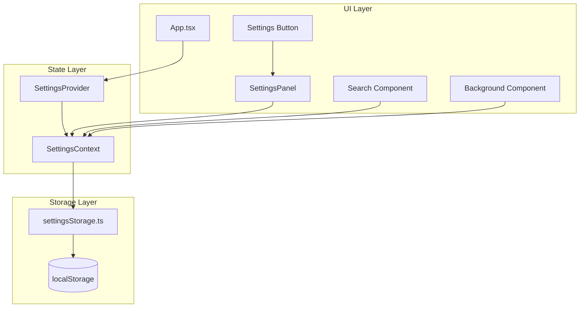

# Design Document: Settings Panel and Search Enhancement

## Overview

本设计为新标签页应用添加设置面板和搜索增强功能。采用 React Context 管理全局设置状态，使用 localStorage 实现持久化。设计遵循现有项目的组件结构和样式规范。

## Architecture



## Components and Interfaces

### Settings Context

```typescript
// src/contexts/SettingsContext.tsx

interface Settings {
  backgroundUrl: string;
  searchEngine: SearchEngine;
  searchHistory: string[];
}

interface SettingsContextValue {
  settings: Settings;
  updateBackgroundUrl: (url: string) => void;
  updateSearchEngine: (engine: SearchEngine) => void;
  addSearchHistory: (query: string) => void;
  clearSearchHistory: () => void;
  removeSearchHistoryItem: (query: string) => void;
}

const DEFAULT_SETTINGS: Settings = {
  backgroundUrl: 'https://images.unsplash.com/photo-1506905925346-21bda4d32df4?w=1920&q=80',
  searchEngine: 'bing',
  searchHistory: [],
};
```

### Settings Panel Component

```typescript
// src/components/Settings/SettingsPanel.tsx

interface SettingsPanelProps {
  isOpen: boolean;
  onClose: () => void;
}

// 内部状态管理预览和验证
interface PanelState {
  previewUrl: string;
  urlError: string | null;
  isValidating: boolean;
}
```

### Settings Button Component

```typescript
// src/components/Settings/SettingsButton.tsx

interface SettingsButtonProps {
  onClick: () => void;
  className?: string;
}
```

### Updated Search Component

```typescript
// src/components/Search/Search.tsx (updated)

interface SearchProps {
  placeholder?: string;
  className?: string;
  // searchEngine prop removed - now from context
}

interface SearchState {
  query: string;
  showHistory: boolean;
}
```

## Data Models

### Settings Storage Schema

```typescript
// src/utils/settingsStorage.ts

const STORAGE_KEY = 'newtab-settings';

interface StoredSettings {
  backgroundUrl: string;
  searchEngine: SearchEngine;
  searchHistory: string[];
  version: number; // for future migrations
}

// Storage functions
function saveSettings(settings: Settings): void;
function loadSettings(): Settings;
function isStorageAvailable(): boolean;
```

### Search History Management

```typescript
const MAX_HISTORY_ITEMS = 10;

function addToHistory(history: string[], query: string): string[] {
  // Remove duplicates, add to front, limit to MAX_HISTORY_ITEMS
  const filtered = history.filter(item => item !== query);
  return [query, ...filtered].slice(0, MAX_HISTORY_ITEMS);
}
```


## Correctness Properties

*A property is a characteristic or behavior that should hold true across all valid executions of a system—essentially, a formal statement about what the system should do. Properties serve as the bridge between human-readable specifications and machine-verifiable correctness guarantees.*

### Property 1: Settings Round-Trip Persistence

*For any* valid Settings object, saving to localStorage then loading should produce an equivalent Settings object.

**Validates: Requirements 2.5, 3.4, 4.6, 5.2, 5.4, 5.5**

### Property 2: Background URL Storage

*For any* valid image URL string, when saved as backgroundUrl, the Settings_Store should contain that exact URL.

**Validates: Requirements 2.1**

### Property 3: Search Engine Selection Storage

*For any* valid SearchEngine value (bing, google, baidu), when selected, the Settings_Store should contain that exact value.

**Validates: Requirements 3.2**

### Property 4: Search History Addition

*For any* non-empty search query string, performing a search should result in that query appearing in the search history.

**Validates: Requirements 4.1**

### Property 5: Search History Maximum Length Invariant

*For any* sequence of search operations, the search history length should never exceed 10 items.

**Validates: Requirements 4.4**

### Property 6: Search History Deduplication

*For any* search query that already exists in history, adding it again should move it to the front without creating duplicates.

**Validates: Requirements 4.1, 4.4**

## Error Handling

### Background URL Validation

1. **Invalid URL Format**: Display error message "请输入有效的图片 URL"
2. **Image Load Failure**: Display error message "图片加载失败，请检查 URL"
3. **Network Error**: Retain previous background, show error notification

### Storage Errors

1. **localStorage Unavailable**: Fall back to in-memory storage, warn user settings won't persist
2. **Corrupted Data**: Reset to default settings, log error
3. **Quota Exceeded**: Warn user, attempt to clear old data

### Search Errors

1. **Empty Query**: Prevent search, no error shown
2. **Special Characters**: URL-encode query before search

## Testing Strategy

### Property-Based Testing

Use `fast-check` library for property-based tests:

- **Settings Persistence**: Generate random Settings objects, verify round-trip
- **Search History**: Generate random sequences of queries, verify invariants
- **URL Handling**: Generate random URL strings, verify storage behavior

Each property test should run minimum 100 iterations.

### Unit Testing

- Settings context initialization with defaults
- Individual setting update functions
- localStorage read/write operations
- Search history management functions
- URL validation logic

### Integration Testing

- Settings panel open/close behavior
- Settings changes propagating to components
- Search with history suggestions
- Background image updates

### Test Annotations

Each property test must be tagged with:
- **Feature: settings-and-search, Property {number}: {property_text}**
