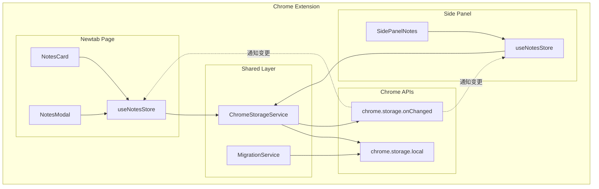
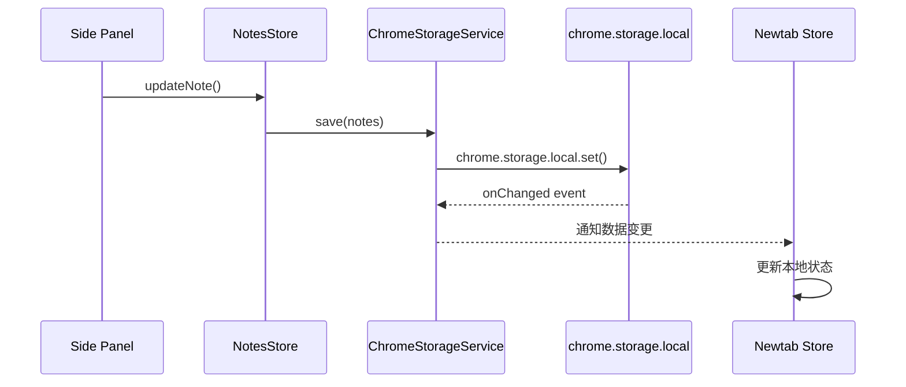
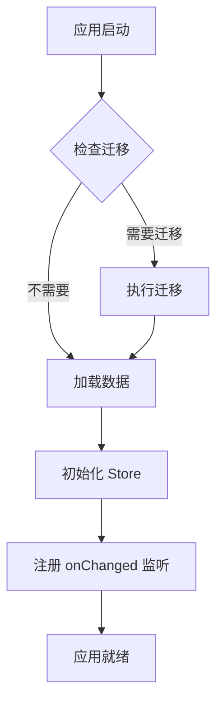

# 设计文档

## 概述

本设计为 Flowmark 浏览器扩展添加 Side Panel 笔记管理功能。核心挑战是实现 newtab 页面和 Side Panel 之间的数据同步，需要将现有的 localStorage 存储迁移到 chrome.storage.local，并使用 chrome.storage.onChanged 事件实现跨页面实时同步。

## 架构

### 整体架构图



### 数据流



## 组件和接口

### 1. ChromeStorageService

负责与 chrome.storage.local 交互的服务层。

```typescript
// src/utils/chromeStorage.ts

interface ChromeStorageService {
  /** 获取存储数据 */
  get<T>(key: string): Promise<T | null>;
  
  /** 设置存储数据 */
  set<T>(key: string, value: T): Promise<void>;
  
  /** 删除存储数据 */
  remove(key: string): Promise<void>;
  
  /** 监听数据变更 */
  subscribe(key: string, callback: (newValue: unknown, oldValue: unknown) => void): () => void;
}
```

### 2. 重构后的 NotesStore

使用 chrome.storage.local 作为持久化后端。

```typescript
// src/plugins/builtin/notes/store.ts

interface NotesState {
  notes: Note[];
  isLoading: boolean;
  
  // 操作方法
  loadNotes: () => Promise<void>;
  addNote: () => Promise<string>;
  updateNote: (id: string, updates: Partial<Note>) => Promise<void>;
  deleteNote: (id: string) => Promise<void>;
  clearAllNotes: () => Promise<void>;
  
  // 内部方法
  _setNotes: (notes: Note[]) => void;
}
```

### 3. MigrationService

负责从 localStorage 迁移数据到 chrome.storage.local。

```typescript
// src/utils/migration.ts

interface MigrationService {
  /** 检查是否需要迁移 */
  needsMigration(): Promise<boolean>;
  
  /** 执行数据迁移 */
  migrate(): Promise<MigrationResult>;
}

interface MigrationResult {
  success: boolean;
  migratedCount: number;
  error?: string;
}
```

### 4. Side Panel 组件

```typescript
// src/sidepanel/SidePanelNotes.tsx

interface SidePanelNotesProps {
  // 无需 props，直接使用 store
}
```

## 数据模型

### Note 类型（保持不变）

```typescript
interface Note {
  id: string;
  title: string;
  content: string;
  createdAt: number;
  updatedAt: number;
}
```

### 存储格式

```typescript
// chrome.storage.local 中的数据格式
interface NotesStorageData {
  notes: Note[];
  version: number;  // 用于未来数据迁移
}

// 存储键名
const STORAGE_KEY = 'notes-plugin-data';
```

### 序列化/反序列化

```typescript
// 序列化
function serialize(data: NotesStorageData): string {
  return JSON.stringify(data);
}

// 反序列化
function deserialize(json: string): NotesStorageData {
  return JSON.parse(json);
}
```


## 文件结构

```
extension/
├── manifest.json          # 更新：添加 sidePanel 权限和配置
├── sidepanel.html         # 新增：Side Panel 入口 HTML
├── index.html             # 保持不变
└── assets/                # 构建产物

src/
├── utils/
│   ├── chromeStorage.ts   # 新增：Chrome Storage 服务
│   └── migration.ts       # 新增：数据迁移服务
├── sidepanel/
│   ├── main.tsx           # 新增：Side Panel React 入口
│   ├── App.tsx            # 新增：Side Panel 根组件
│   └── SidePanelNotes.tsx # 新增：笔记管理组件
├── plugins/builtin/notes/
│   ├── store.ts           # 修改：使用 chrome.storage
│   └── ...                # 其他文件保持不变
└── ...
```

## 构建配置

### Vite 多入口配置

```typescript
// vite.config.ts
export default defineConfig({
  build: {
    rollupOptions: {
      input: {
        main: resolve(__dirname, 'index.html'),
        sidepanel: resolve(__dirname, 'sidepanel.html'),
      },
      output: {
        entryFileNames: 'assets/[name].js',
        chunkFileNames: 'assets/[name].js',
        assetFileNames: 'assets/[name].[ext]',
      },
    },
  },
});
```

### Manifest 配置

```json
{
  "manifest_version": 3,
  "name": "Flowmark",
  "version": "1.1.0",
  "permissions": [
    "storage",
    "sidePanel"
  ],
  "side_panel": {
    "default_path": "sidepanel.html"
  },
  "action": {
    "default_title": "打开笔记面板"
  },
  "background": {
    "service_worker": "assets/background.js"
  },
  "chrome_url_overrides": {
    "newtab": "index.html"
  }
}
```

## 同步机制详细设计

### 初始化流程



### 数据同步流程

1. **写入流程**：
   - 用户操作触发 store action
   - Store 更新本地状态
   - 调用 ChromeStorageService.set() 写入 chrome.storage
   - chrome.storage 触发 onChanged 事件

2. **同步流程**：
   - onChanged 事件被所有页面接收
   - 检查变更来源（避免自己触发的变更重复处理）
   - 更新本地 store 状态
   - React 组件自动重新渲染

### 防抖处理

为避免频繁写入，对 updateNote 操作进行防抖：

```typescript
const debouncedSave = debounce(async (notes: Note[]) => {
  await chromeStorage.set(STORAGE_KEY, { notes, version: 1 });
}, 300);
```

## 错误处理

### 错误类型

| 错误类型 | 处理方式 |
|---------|---------|
| 存储配额超限 | 提示用户清理数据 |
| 序列化失败 | 记录日志，保持当前状态 |
| 同步超时 | 重试机制（最多 3 次） |
| 迁移失败 | 保留原数据，记录错误 |

### 错误处理示例

```typescript
try {
  await chromeStorage.set(key, data);
} catch (error) {
  if (error.message.includes('QUOTA_BYTES')) {
    console.error('存储配额超限');
    // 通知用户
  } else {
    console.error('存储失败:', error);
  }
}
```


## 正确性属性

*正确性属性是在系统所有有效执行中都应保持为真的特征或行为——本质上是关于系统应该做什么的形式化陈述。属性作为人类可读规范和机器可验证正确性保证之间的桥梁。*

### Property 1: 新建笔记增加列表长度

*对于任意* 笔记列表初始状态，执行新建笔记操作后，笔记列表长度应增加 1，且新笔记应出现在列表中。

**验证: 需求 2.2**

### Property 2: 编辑笔记正确更新数据

*对于任意* 笔记和任意有效的更新内容（标题或内容），执行更新操作后，该笔记的对应字段应等于更新值，且 updatedAt 时间戳应更新。

**验证: 需求 2.4**

### Property 3: 删除笔记正确移除数据

*对于任意* 包含至少一条笔记的列表，删除其中任意一条笔记后，列表长度应减少 1，且被删除的笔记 ID 不应出现在列表中。

**验证: 需求 2.5**

### Property 4: 搜索返回匹配标题的笔记

*对于任意* 笔记列表和任意搜索关键词，搜索结果中的每条笔记的标题或内容都应包含该关键词（不区分大小写）。

**验证: 需求 2.6**

### Property 5: 序列化往返一致性

*对于任意* 有效的笔记数据，序列化后再反序列化应产生与原始数据等价的结果。

**验证: 需求 3.5**

### Property 6: 存储变更通知所有监听者

*对于任意* 存储变更事件和任意数量的监听者，所有已注册的监听者都应收到变更通知，且通知内容应包含正确的新值和旧值。

**验证: 需求 4.1**

### Property 7: 数据迁移保持数据完整性

*对于任意* localStorage 中的有效笔记数据，迁移到 chrome.storage 后，数据应保持完整且等价。

**验证: 需求 6.2**

## 测试策略

### 测试框架

- **单元测试**: Vitest
- **属性测试**: fast-check（与 Vitest 集成）
- **E2E 测试**: Playwright（用于扩展测试）

### 测试分类

| 测试类型 | 覆盖范围 | 工具 |
|---------|---------|------|
| 单元测试 | ChromeStorageService、MigrationService | Vitest |
| 属性测试 | 数据操作、序列化、搜索 | fast-check |
| 组件测试 | SidePanelNotes 组件 | Vitest + React Testing Library |
| E2E 测试 | 跨页面同步 | Playwright |

### 属性测试配置

```typescript
// 每个属性测试至少运行 100 次迭代
fc.assert(
  fc.property(noteArbitrary, (note) => {
    // 测试逻辑
  }),
  { numRuns: 100 }
);
```

### 测试标签格式

每个属性测试必须包含注释引用设计文档中的属性：

```typescript
// Feature: side-panel-notes, Property 5: 序列化往返一致性
test.prop([noteArbitrary])('serialize then deserialize equals original', (note) => {
  // ...
});
```

### Mock 策略

由于 chrome.storage API 在非扩展环境不可用，需要 mock：

```typescript
// 测试环境中 mock chrome.storage
const mockChromeStorage = {
  local: {
    get: vi.fn(),
    set: vi.fn(),
    remove: vi.fn(),
  },
  onChanged: {
    addListener: vi.fn(),
    removeListener: vi.fn(),
  },
};

globalThis.chrome = { storage: mockChromeStorage } as any;
```
