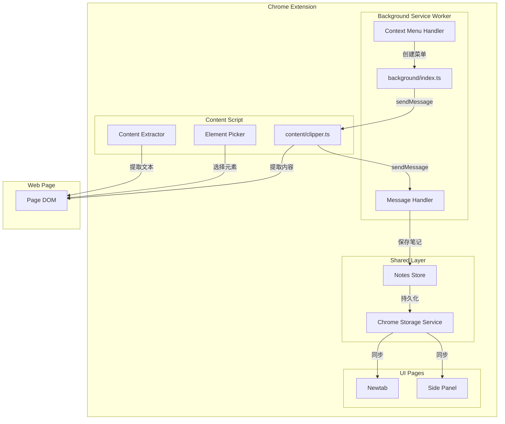
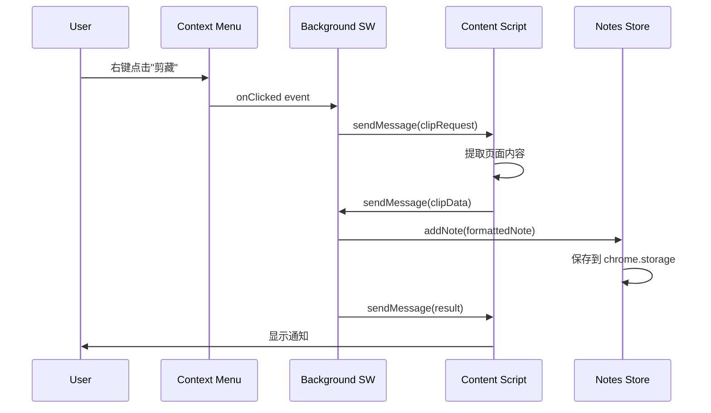
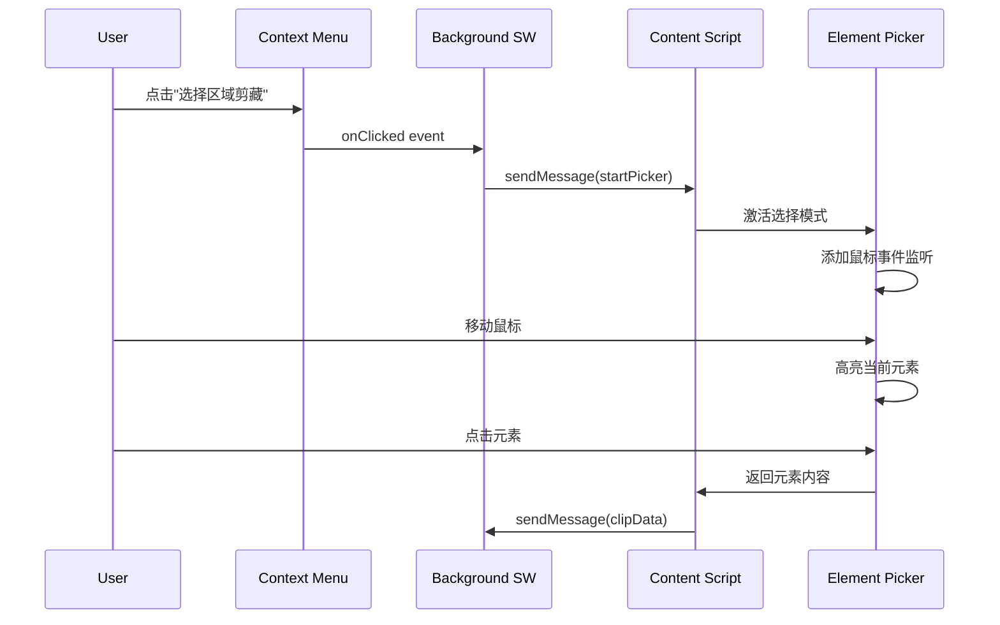

# 设计文档

## 概述

本设计为 Flowmark 浏览器扩展添加网页剪藏功能。该功能允许用户通过右键菜单、快捷键或可视化元素选择器将网页内容剪藏为笔记。核心挑战包括：Content Script 与 Background Service Worker 的消息通信、DOM 元素选择器的实现、以及与现有笔记系统的无缝集成。

## 架构

### 整体架构图



### 消息通信流程



### 元素选择模式流程



## 组件和接口

### 1. Message Types

定义 Background 和 Content Script 之间的消息类型。

```typescript
// src/types/clipper.ts

/** 剪藏类型 */
type ClipType = 'selection' | 'page' | 'element';

/** 剪藏请求消息 */
interface ClipRequest {
  type: 'CLIP_REQUEST';
  clipType: ClipType;
}

/** 启动元素选择器消息 */
interface StartPickerRequest {
  type: 'START_PICKER';
}

/** 剪藏数据 */
interface ClipData {
  title: string;
  url: string;
  content: string;
  clipType: ClipType;
  timestamp: number;
}

/** 剪藏结果消息 */
interface ClipResult {
  type: 'CLIP_RESULT';
  success: boolean;
  noteId?: string;
  error?: string;
}

/** 显示通知消息 */
interface ShowNotification {
  type: 'SHOW_NOTIFICATION';
  success: boolean;
  message: string;
}

/** 所有消息类型联合 */
type ClipperMessage = 
  | ClipRequest 
  | StartPickerRequest 
  | ClipResult 
  | ShowNotification;
```

### 2. Content Extractor

负责从页面提取内容的模块。

```typescript
// src/content/extractor.ts

interface ContentExtractor {
  /** 获取页面标题 */
  getTitle(): string;
  
  /** 获取页面 URL */
  getUrl(): string;
  
  /** 获取选中的文本 */
  getSelection(): string;
  
  /** 获取页面主要内容 */
  getPageContent(): string;
  
  /** 获取指定元素的内容 */
  getElementContent(element: HTMLElement): string;
}
```

### 3. Element Picker

可视化元素选择器组件。

```typescript
// src/content/elementPicker.ts

interface ElementPicker {
  /** 激活选择模式 */
  activate(): void;
  
  /** 停用选择模式 */
  deactivate(): void;
  
  /** 是否处于激活状态 */
  isActive(): boolean;
  
  /** 设置元素选中回调 */
  onSelect(callback: (element: HTMLElement) => void): void;
  
  /** 设置取消回调 */
  onCancel(callback: () => void): void;
}
```

### 4. Clipper Service

剪藏服务，协调内容提取和消息通信。

```typescript
// src/content/clipperService.ts

interface ClipperService {
  /** 剪藏选中内容 */
  clipSelection(): Promise<ClipData>;
  
  /** 剪藏整个页面 */
  clipPage(): Promise<ClipData>;
  
  /** 剪藏指定元素 */
  clipElement(element: HTMLElement): Promise<ClipData>;
  
  /** 启动元素选择模式 */
  startElementPicker(): void;
}
```

### 5. Note Formatter

将剪藏数据格式化为笔记内容。

```typescript
// src/utils/noteFormatter.ts

interface NoteFormatter {
  /** 格式化剪藏数据为笔记 */
  format(clipData: ClipData): { title: string; content: string };
}
```

### 6. Background Clipper Handler

Background Service Worker 中的剪藏处理器。

```typescript
// src/background/clipperHandler.ts

interface ClipperHandler {
  /** 初始化右键菜单 */
  initContextMenus(): void;
  
  /** 处理剪藏请求 */
  handleClipRequest(tabId: number, clipType: ClipType): Promise<void>;
  
  /** 保存剪藏为笔记 */
  saveClip(clipData: ClipData): Promise<string>;
}
```

## 数据模型

### ClipData 类型

```typescript
interface ClipData {
  /** 页面标题 */
  title: string;
  /** 页面 URL */
  url: string;
  /** 剪藏的内容 */
  content: string;
  /** 剪藏类型 */
  clipType: 'selection' | 'page' | 'element';
  /** 剪藏时间戳 */
  timestamp: number;
}
```

### Note 类型（复用现有）

```typescript
interface Note {
  id: string;
  title: string;
  content: string;
  createdAt: number;
  updatedAt: number;
}
```

### 格式化后的笔记内容模板

```markdown
> 来源: [页面标题](页面URL)
> 剪藏时间: YYYY-MM-DD HH:mm

---

[剪藏的内容]
```

## 文件结构

```
src/
├── types/
│   └── clipper.ts           # 新增：剪藏相关类型定义
├── content/
│   ├── index.ts             # 新增：Content Script 入口
│   ├── extractor.ts         # 新增：内容提取器
│   ├── elementPicker.ts     # 新增：元素选择器
│   ├── clipperService.ts    # 新增：剪藏服务
│   └── notification.ts      # 新增：页面内通知组件
├── background/
│   ├── index.ts             # 修改：添加剪藏处理
│   └── clipperHandler.ts    # 新增：剪藏处理器
├── utils/
│   └── noteFormatter.ts     # 新增：笔记格式化工具
└── plugins/builtin/notes/
    └── store.ts             # 复用：笔记存储
```

### Manifest 更新

```json
{
  "permissions": [
    "storage",
    "sidePanel",
    "contextMenus",
    "activeTab",
    "scripting"
  ],
  "commands": {
    "clip-content": {
      "suggested_key": {
        "default": "Alt+Shift+C"
      },
      "description": "剪藏当前页面内容"
    }
  },
  "content_scripts": [
    {
      "matches": ["<all_urls>"],
      "js": ["assets/content.js"],
      "css": ["assets/content.css"]
    }
  ]
}
```

## 元素选择器详细设计

### 视觉效果

```css
/* 高亮覆盖层样式 */
.flowmark-picker-overlay {
  position: fixed;
  pointer-events: none;
  border: 2px solid #1890ff;
  background: rgba(24, 144, 255, 0.1);
  z-index: 2147483647;
  transition: all 0.1s ease;
}

/* 提示文字 */
.flowmark-picker-tooltip {
  position: fixed;
  bottom: 20px;
  left: 50%;
  transform: translateX(-50%);
  background: rgba(0, 0, 0, 0.8);
  color: white;
  padding: 8px 16px;
  border-radius: 4px;
  font-size: 14px;
  z-index: 2147483647;
}
```

### 实现逻辑

```typescript
class ElementPicker {
  private overlay: HTMLElement | null = null;
  private tooltip: HTMLElement | null = null;
  private currentElement: HTMLElement | null = null;
  private selectCallback: ((el: HTMLElement) => void) | null = null;
  private cancelCallback: (() => void) | null = null;
  private active = false;

  activate() {
    this.active = true;
    this.createOverlay();
    this.createTooltip();
    this.addEventListeners();
  }

  deactivate() {
    this.active = false;
    this.removeOverlay();
    this.removeTooltip();
    this.removeEventListeners();
  }

  private handleMouseMove = (e: MouseEvent) => {
    const element = document.elementFromPoint(e.clientX, e.clientY) as HTMLElement;
    if (element && element !== this.currentElement) {
      this.currentElement = element;
      this.updateOverlay(element);
    }
  };

  private handleClick = (e: MouseEvent) => {
    e.preventDefault();
    e.stopPropagation();
    if (this.currentElement && this.selectCallback) {
      this.selectCallback(this.currentElement);
    }
    this.deactivate();
  };

  private handleKeyDown = (e: KeyboardEvent) => {
    if (e.key === 'Escape') {
      if (this.cancelCallback) {
        this.cancelCallback();
      }
      this.deactivate();
    }
  };
}
```

## 错误处理

### 错误类型

| 错误场景 | 处理方式 |
|---------|---------|
| Content Script 未加载 | 尝试注入脚本，失败则提示用户刷新页面 |
| 页面无法访问（chrome://、扩展页面等） | 显示"此页面无法剪藏"提示 |
| 内容提取失败 | 记录日志，返回空内容 |
| 笔记保存失败 | 显示错误通知，提示重试 |
| 存储配额超限 | 提示用户清理旧笔记 |

### 错误处理示例

```typescript
async function handleClipRequest(tabId: number, clipType: ClipType) {
  try {
    // 检查是否可以访问该页面
    const tab = await chrome.tabs.get(tabId);
    if (!tab.url || tab.url.startsWith('chrome://')) {
      throw new Error('此页面无法剪藏');
    }

    // 发送剪藏请求到 Content Script
    const response = await chrome.tabs.sendMessage(tabId, {
      type: 'CLIP_REQUEST',
      clipType
    });

    // 保存笔记
    const noteId = await saveClip(response);
    
    // 通知成功
    await chrome.tabs.sendMessage(tabId, {
      type: 'SHOW_NOTIFICATION',
      success: true,
      message: '剪藏成功'
    });
  } catch (error) {
    // 通知失败
    await chrome.tabs.sendMessage(tabId, {
      type: 'SHOW_NOTIFICATION',
      success: false,
      message: error.message || '剪藏失败'
    });
  }
}
```


## 正确性属性

*正确性属性是在系统所有有效执行中都应保持为真的特征或行为——本质上是关于系统应该做什么的形式化陈述。属性作为人类可读规范和机器可验证正确性保证之间的桥梁。*

### Property 1: 剪藏数据完整性

*对于任意* 有效的网页和任意剪藏类型（selection/page/element），执行剪藏操作后返回的 ClipData 应包含非空的 title、有效的 URL、以及与剪藏类型对应的 content。

**验证: 需求 1.4, 1.5, 2.1, 2.2**

### Property 2: 选中文本准确性

*对于任意* 页面上的文本选择，剪藏选中内容时返回的 content 应与 `window.getSelection().toString()` 的结果完全一致。

**验证: 需求 2.3**

### Property 3: 页面内容提取非空性

*对于任意* 包含可见文本内容的网页，剪藏整个页面时返回的 content 应为非空字符串。

**验证: 需求 2.4**

### Property 4: 笔记格式化完整性

*对于任意* 有效的 ClipData，格式化后的笔记应满足：
- title 等于 ClipData.title
- content 包含 ClipData.url
- content 包含 ClipData.content
- content 符合 Markdown 格式（包含引用块和分隔线）

**验证: 需求 3.1, 3.2, 3.3, 3.4, 3.5**

### Property 5: 笔记存储集成

*对于任意* 成功的剪藏操作，Notes Store 中应新增一条笔记，且该笔记的 title 和 content 与格式化结果一致。

**验证: 需求 4.1**

### Property 6: 元素高亮跟随

*对于任意* 处于元素选择模式的页面，当鼠标移动到任意可见元素上时，高亮覆盖层的位置和尺寸应与该元素的 `getBoundingClientRect()` 结果一致。

**验证: 需求 7.2, 7.3**

### Property 7: 元素内容提取

*对于任意* DOM 元素，在元素选择模式下点击该元素后，返回的 content 应包含该元素的 `innerText` 或 `textContent`。

**验证: 需求 7.4**

### Property 8: 选择模式点击拦截

*对于任意* 处于元素选择模式的页面，所有点击事件应被拦截（`preventDefault` 和 `stopPropagation` 被调用），不触发页面原有的点击行为。

**验证: 需求 7.7**

## 测试策略

### 测试框架

- **单元测试**: Vitest
- **属性测试**: fast-check（与 Vitest 集成）
- **E2E 测试**: Playwright（用于扩展测试）

### 测试分类

| 测试类型 | 覆盖范围 | 工具 |
|---------|---------|------|
| 单元测试 | ContentExtractor、NoteFormatter、ElementPicker | Vitest |
| 属性测试 | 数据完整性、格式化、元素操作 | fast-check |
| 集成测试 | Background 与 Content Script 通信 | Vitest + Mock |
| E2E 测试 | 完整剪藏流程 | Playwright |

### 属性测试配置

每个属性测试至少运行 100 次迭代：

```typescript
import { fc } from '@fast-check/vitest';

// Feature: web-clipping, Property 1: 剪藏数据完整性
test.prop([clipDataArbitrary])('clip data should be complete', (clipData) => {
  expect(clipData.title).toBeTruthy();
  expect(clipData.url).toMatch(/^https?:\/\//);
  expect(clipData.content).toBeDefined();
}, { numRuns: 100 });
```

### 测试标签格式

每个属性测试必须包含注释引用设计文档中的属性：

```typescript
// Feature: web-clipping, Property N: [属性标题]
```

### Mock 策略

#### Chrome API Mock

```typescript
const mockChrome = {
  contextMenus: {
    create: vi.fn(),
    onClicked: { addListener: vi.fn() }
  },
  tabs: {
    sendMessage: vi.fn(),
    get: vi.fn()
  },
  runtime: {
    onMessage: { addListener: vi.fn() }
  },
  commands: {
    onCommand: { addListener: vi.fn() }
  }
};

globalThis.chrome = mockChrome as any;
```

#### DOM Mock

```typescript
// 模拟 document 和 window 对象用于 Content Script 测试
const mockDocument = {
  title: 'Test Page',
  body: { innerText: 'Test content' },
  elementFromPoint: vi.fn()
};

const mockWindow = {
  getSelection: vi.fn(() => ({
    toString: () => 'selected text'
  })),
  location: { href: 'https://example.com/page' }
};
```

### 单元测试重点

1. **ContentExtractor**
   - 测试各种页面结构的内容提取
   - 测试空页面、无文本页面的边界情况

2. **NoteFormatter**
   - 测试各种 ClipData 的格式化输出
   - 验证 Markdown 格式正确性

3. **ElementPicker**
   - 测试激活/停用状态切换
   - 测试高亮位置计算
   - 测试事件拦截

### E2E 测试场景

1. 右键菜单剪藏选中文本
2. 右键菜单剪藏整个页面
3. 元素选择模式剪藏
4. 快捷键剪藏
5. 剪藏后笔记同步到 Side Panel
